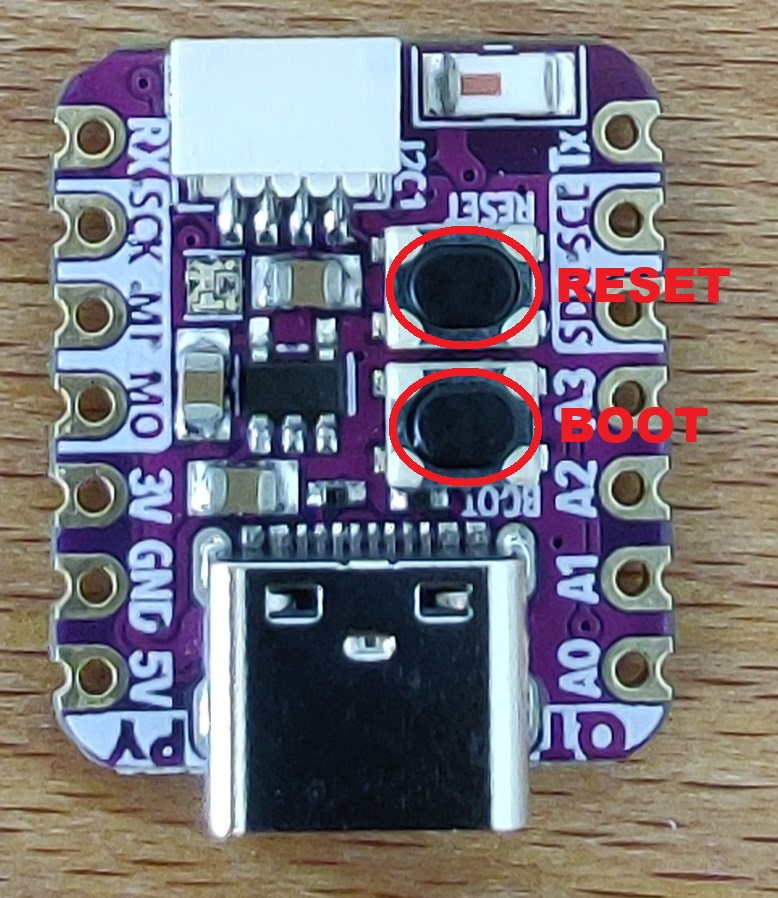

# Polaris Beacon


This repository contains the firmware for the ESP32-S3 based beacons used in the Polaris project. Polaris is a secure, opportunistic Proof-of-Location (PoL)  system. This firmware enables the beacons to act as trusted,  fixed-location anchors.

The beacons have two primary responsibilities:

1. Engage in a challenge-response protocol with nearby mobile devices to issue cryptographically signed, unforgeable PoL tokens.
2. Participate in an end-to-end encrypted communication channel with a  central server, using mobile devices as untrusted, opportunistic relays  (data mules).

Status: *Not production-ready*

Board Target: Adafruit QT Py ESP32-S3 (N4R2)

Framework: Arduino (via PlatformIO)

Language: C++

## Overview

Polaris Beacon is an embedded BLE application for ESP32-S3 boards. It implements a proof-of-location protocol over BLE using cryptographic signatures (Ed25519).

This project is part of an experimental system — it is **not ready for production**, and **no support or contributions** will be accepted at this stage.

## Features

- Layered architecture: Clear separation of concerns between BLE handling, protocol logic, and  hardware utilities, promoting maintainability and extensibility.
- Asynchronous processing: Utilizes a FreeRTOS queue-per-task model to decouple the BLE stack from application logic, ensuring high responsiveness and stability.
- Cryptography: Implements a strong security model using libsodium:
  - Ed25519 for signing PoL tokens and broadcast advertisements.
  - X25519 for an Elliptic-Curve Diffie-Hellman (ECDH) key exchange.
  - ChaCha20-Poly1305 for authenticated encryption with associated data (AEAD) of server commands.
- BLE handling:
  - Multi-advertising: Simultaneously broadcasts a connectable legacy advertisement and a  non-connectable extended advertisement with a signed payload.
  - Application-layer fragmentation: A custom transport layer fragments and reassembles messages larger than the connection's MTU, ensuring reliable large data transfer.
- Persistent state: Uses the ESP32's Non-Volatile Storage (NVS) to persist the beacon's  cryptographic identity and monotonic counter across reboots.
- Extensible command system: A flexible Command Pattern implementation allows new remote commands  from the server to be added easily without altering the core protocol  handler.


## Project structure

```
polaris-beacon/
├── src/
│   ├── main.cpp                # Entry point
│   ├── ble/                    # BLE server implementation
│   ├── protocol/               # PoLRequest/PoLResponse structures
│   │    ├── handlers/			# Classes that handle incoming and outgoing requests
│   │    ├── messages/			# Classes that define the messages structure
│   │    └── transport			# Classes that handle the fragmentation layer
│   └── utils/                  # Helpers like `counter`
├── include/                    # Shared headers (optional)
├── lib/                        # External libraries (if needed)
└── platformio.ini              # Build configuration

```


## Getting started

### Requirements

- [PlatformIO](https://platformio.org/) (installed via VSCode or CLI)
- Adafruit QT Py ESP32-S3 (N4R2) board
- USB cable (data-capable)
- Serial monitor (e.g., PlatformIO built-in terminal)

### Installation

1. Clone the repository:

   ```bash
   git clone https://github.com/DrC0okie/polaris.git
   cd polaris/polaris-beacon    
   ```

Open the project in VS Code:

- Launch Visual Studio Code.
- Go to File > Open Folder... and select the cloned polaris-beacon directory.

- PlatformIO will automatically detect the platformio.ini file

## Configuration

Defined in `platformio.ini`:

```ini
; PlatformIO Project Configuration File
[env:adafruit_qtpy_esp32s3_n4r2]
platform = espressif32
board = adafruit_qtpy_esp32s3_n4r2
framework = arduino
monitor_speed = 115200
monitor_rts = 0
monitor_dtr = 0
build_flags = 
	-DARDUINO_USB_MODE=1
	-DARDUINO_USB_CDC_ON_BOOT=1
	-DARDUINO_USB_MSC_OFF
	-DBOARD_HAS_PSRAM
	-mfix-esp32-psram-cache-issue
	-DCONFIG_BT_BLE_50_FEATURES_SUPPORTED

lib_deps =
	adafruit/Adafruit NeoPixel@^1.15.1
	adafruit/Adafruit GFX Library@^1.12.1
	adafruit/Adafruit SSD1306@^2.5.14
	bblanchon/ArduinoJson@^7.4.2
```

## Provisioning

For the end-to-end encrypted channel to work, the beacon must know the server's X25519 public key. For this proof-of-concept, the key is hardcoded. Before flashing, you must update this key in src/utils/key_manager.h:

```cpp
// Replace this with the actual public key of your Polaris server.
static constexpr const uint8_t HARDCODED_SERVER_X25519_PK[X25519_PK_SIZE] = {
    0xdc, 0x8f, 0xbf, 0x40, 0xa9, 0x5e, 0x34, 0x2e, 0xc5, 0xd3, 0x13, 0xc7, 0x13, 0xe6, 0x91, 0x9f,
    0xcc, 0x81, 0x7e, 0x22, 0x07, 0x98, 0xc9, 0x39, 0x20, 0x2c, 0xc8, 0xfb, 0x08, 0x47, 0x8f, 0x7e};
```

To configure multiple beacons you must give to each one a separate unique id. This identifier `BEACON_ID` can be changed in src/protocol/pol_constants.h

### Build, flash, and monitor

You can perform all actions using the PlatformIO sidebar in VS Code or via the command line.

| Action               | VS Code UI                                                   | CLI Command                  |
| -------------------- | ------------------------------------------------------------ | ---------------------------- |
| **Build**            | Click the checkmark icon (PlatformIO: Build) in the status bar. | pio run                      |
| **Upload**           | Click the right-arrow icon (PlatformIO: Upload) in the status bar. | pio run -t upload            |
| **Monitor**          | Click the plug icon (PlatformIO: Serial Monitor) in the status bar. | pio device monitor -b 115200 |
| **Upload & Monitor** | Use the PlatformIO: Upload and Monitor task in the PIO Project Tasks view. | pio run -t upload -t monitor |


To upload the program to the board, you must:

1. Hold the boot button
2. While holing th boot button, connect the board via USB to your machine
3. Release the Boot button
4. Upload the program
5. Press the Reset button





### First boot & operation

- Key generation: On its very first boot, the beacon will not find any keys in NVS. It will automatically generate a new Ed25519 and X25519 key pair and save them to flash memory. Subsequent boots will load these existing keys.
- Serial output: The serial monitor will show a detailed log of the initialization  process, including the beacon's public keys and status updates. This is  the primary tool for debugging.
- Advertising: Once initialized, the beacon will begin its two advertisements, ready to interact with mobile clients.

## Limitations & disclaimer

- The current implementation can only handle one connected BLE client at a time. A multi-client architecture would require significant refactoring to manage session state per connection.
-  The BEACON_ID and server public key are hardcoded. A production system would require a secure provisioning mechanism.
- Server commands use JSON, which is flexible but inefficient. Migrating  to a binary format like Protobuf or MessagePack would reduce latency and data usage.
- The project lacks an automated testing suite, which is critical for  ensuring long-term stability and facilitating safe refactoring.

**Disclaimer : This project is not production-ready**

- Not guaranteed to be stable.
- BLE protocol and project structure can evolve.
- No contributions or support requests will be considered at this time.


## License

This project original code is currently distributed for educational and internal research purposes only. Licensing terms for the original contributions to Polaris Beacon will be defined at a later date.

This project relies on several third-party libraries and components, each with its own license:

### Dependencies

*   [ESP32 Arduino core](https://github.com/espressif/arduino-esp32) 
*   [libsodium](https://github.com/esphome/libsodium-esphome)
*   [Adafruit NeoPixel](https://www.google.com/url?sa=E&q=https%3A%2F%2Fgithub.com%2Fadafruit%2FAdafruit_NeoPixel): For controlling the on-board RGB LED.
*   [Adafruit GFX Library](https://www.google.com/url?sa=E&q=https%3A%2F%2Fgithub.com%2Fadafruit%2FAdafruit-GFX-Library): Core graphics library for the display.
*   [Adafruit SSD1306](https://www.google.com/url?sa=E&q=https%3A%2F%2Fgithub.com%2Fadafruit%2FAdafruit_SSD1306): Driver for the optional OLED display.
*   [ArduinoJson](https://www.google.com/url?sa=E&q=https%3A%2F%2Farduinojson.org%2F): For parsing JSON payloads in server commands.

## External resources

* [Adafruit QT Py ESP32-S3 (N4R2) board detail](https://www.adafruit.com/product/5700)
* [Adafruit documentation](https://learn.adafruit.com/adafruit-qt-py-esp32-s3/overview)
* [PlatformIO IDE](https://docs.platformio.org/en/latest/integration/ide/pioide.html)
* [libsodium documentation](https://doc.libsodium.org/)
* [libsodium esp32 port](https://github.com/esphome/libsodium-esphome)

